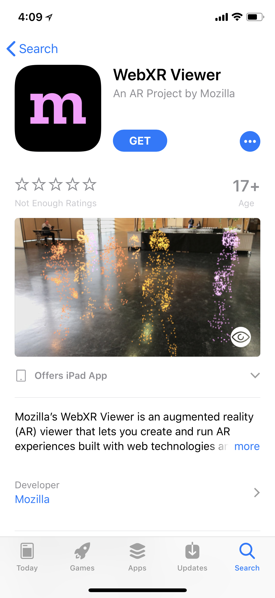
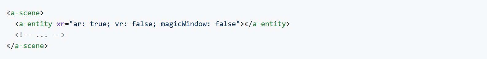

  <h1>AR in the Web</h1>
  
An Overview

  

    @dmarcos | **aframe.io**
  

------

# 3 Years of VR focus

WebVR W3C spec started in 2014

------

# WebVR in a nutshell

<pre style="font-size: 9pt">
  <code class="javascript">
    // Request connected VR headsets
    navigator.getVRDisplays().then(function (displays) { vrDisplay = displays[0];});
    // Request session on a VR headset
    vrDisplay.requestPresent([{ source: canvas }]).then(function() {
      vrDisplay.requestAnimationFrame(render);
    });
    // Render
    function render () { 
      // Schedule next frame
      vrDisplay.requestAnimationFrame(render);
      // Read input data from VR hardware.
      vrDisplay.getFrameData(frameData);
      ... draw pretty picture...
      // Submit picture to the headset.
      vrDisplay.submitFrame();
    }
  </code>
</pre>

------

# WebVR ships today

Chrome for Android\*, Firefox, Microsoft Edge, Oculus Browser, Samsung Internet.

\*Origin trials program

------

# 2018 - From VR to XR 

W3C WebVR community group -> Immersive Web

WebVR API -> WebXR 

https://immersive-web.github.io/webvr/

------

# But I want to play now :(

------

# Experimental browsers to the rescue

**ARKit** (iPhone 6s or newer)

**ARCore** (Pixel 1, Pixel 2, Samsung Galaxy S8)

------

# Experimental viewers to the rescue

Google and Mozilla have released experimental proto browsers.

------

# Experimental viewers to the rescue

Mozilla WebXR Viewer on iOS

 

  
 

------

# Experimental viewers to the rescue

Google **WebAROnARCore** and **WebAROnARKit**

 https://github.com/google-ar/WebARonARCore
 
 https://github.com/google-ar/WebARonARKit

------

# What do the APIs look like

Expose ARCore and ARKit features: planes, anchors, light estimation.

------

# What do the APIs look like

Google's WebAR extends vrDisplay from the WebVR

<pre style="font-size: 9pt">
  <code class="javascript">
    vrDisplay.addEventListener('planesadded', function () {});
    vrDisplay.addEventListener('planesupdated', function () {});
    vrDisplay.addEventListener('planesremoved', function () {});
    vrDisplay.hitTest(x, y);
    vrDisplay.addEventListener('anchorsupdated', function () {});
  </code>
</pre>

------

# Library space **THREE.js**

Google WebAR 

https://github.com/google-ar/three.ar.js

Mozilla WebXR 

https://github.com/mozilla/three.xr.js

------

# Library space **A-Frame**

Mozilla XR component 

https://github.com/mozilla/aframe-xr

 

  
 
